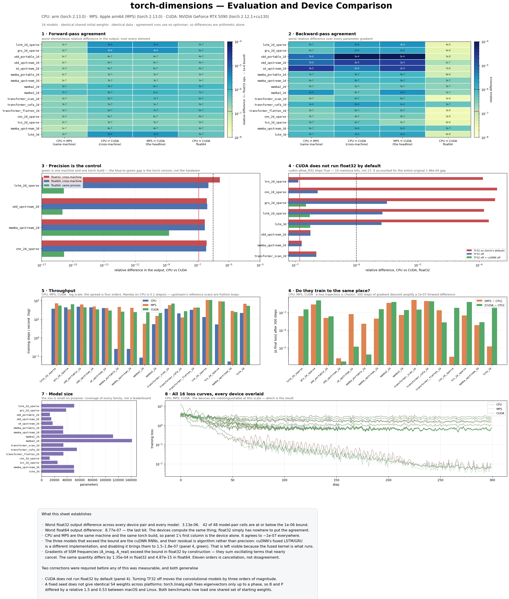

# Documentation

- **[Adding a mixer](adding-a-mixer.md)** — the extension point that matters
  most: a 1-D sequence model becomes an N-D one by satisfying one shape
  contract. Worked example, conformance report, and the mistakes to expect.
- **[Adding an nd_method](adding-a-method.md)** — changing *how* the axes are
  handled rather than what happens along one, including the two bugs the
  conformance suite found in this project's own example strategy.
- **[CUDA verification checklist](cuda-checklist.md)** — every CUDA claim as
  one runnable file, and what it reported on an RTX 5090: 13 passed, 0 failed,
  plus the one gap that a Blackwell card could not close. Fifteen minutes on a
  free Colab T4 to re-run.

- **[Hugging Face model card](hf-card.md)** — the source for
  [`Celsia/torch-dimensions`](https://huggingface.co/Celsia/torch-dimensions),
  where the benchmark checkpoints and agreement runs are published. Edited
  here, uploaded as that repo's `README.md`.

## Evaluation and Device Comparison

One sheet, three devices, sixteen models, two benchmarks — regenerate it with
`python benchmarks/figure.py`. Every panel reads artifact directories that
already exist, so the figure cannot drift from the numbers it draws.

| device | hardware | torch |
|---|---|---|
| **CUDA** | NVIDIA RTX 5090 (Blackwell, sm_120) | 2.12.1+cu130 |
| **MPS** | Apple Mac Studio, M1 Ultra (Metal) | 2.13.0 |
| **CPU** | Apple M1 Ultra (arm64) | 2.13.0 |

All sixteen models on all three devices, in both benchmarks. The throughput
panel is the surprising one: Mamba on CPU runs at 0.1 steps/s against 24 on
CUDA — 455× — because the upstream reference scans are Python loops over
sequence length, while the RTX 5090 *loses* to the M1 Ultra's CPU on the small
S4 models, where launch overhead dominates.

CPU and MPS are the same machine and the same torch build, so the difference
between them is the device alone; CPU-vs-CUDA crosses machines and versions.
Worst float32 output difference across every pair is **3.11e-06**, thirteen of
sixteen models at or below **1e-06**, and **2.2e-16** in float64.

Two corrections were needed before any of that was measurable, and both
generalise beyond this project: CUDA does not run float32 by default
(`cudnn.allow_tf32` ships `True` — TF32 is 10 mantissa bits), and a fixed seed
does not give identical S4 weights across platforms (`torch.linalg.eigh` fixes
eigenvectors only up to a phase). Full detail in
[../BENCH-README.md](../BENCH-README.md) and [../AGREEMENT.md](../AGREEMENT.md).

Elsewhere in the repo: [DESIGN.md](../DESIGN.md) (the architecture),
[PLAN.md](../PLAN.md) (what is built and what is next),
[RESULTS.md](../RESULTS.md) (reproductions),
[BENCHMARKS.md](../BENCHMARKS.md) (measured costs),
[DEBUG.md](../DEBUG.md) (every bug found, and what caught it),
[VIEWER.md](../VIEWER.md) (the GUI).
